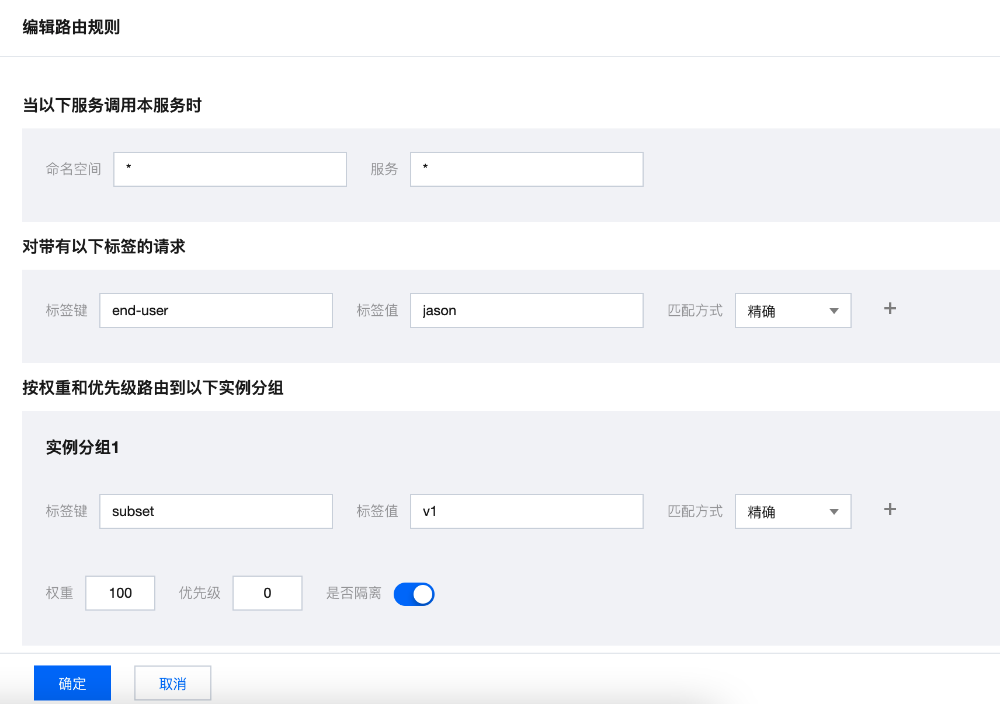

# book info exmaple

本项目与 istio 的 bookinfo demo 基本相同。修改了其中的 reviews 服务和 ratings 服务，details、productpage 与 istio 的 demo 相同。

reviews 在本项目中服务基于 spring cloud tencent 构建，自注册服务。

ratings 增加了参数，控制是否返回错误，用来触发 reviews 服务实例产生熔断。

服务之间的调用关系如下图：


## 部署 demo

reviews 服务为 spring cloud tencent 应用，不需要注入 Envoy ，同时也不需要 Polaris Controller 托管服务注册。这里需要为 reviews 服务指定 Polaris Server 的地址，需要修改 bookinfo.yaml ，将其中 `spring.cloud.polaris.address` 的参数指定为 Polaris Server 的地址。

修改完 reviews 相关的配置后，您可以使用下面命令来创建部署本 demo：

```
kubectl create -f bookinfo.yaml
```

等待所有 pod 转为 `Running` 状态：
```
NAME                              READY   STATUS    RESTARTS   AGE
details-v1-66b6955995-jhnvw       2/2     Running   0          39m
productpage-v1-7955cdc67f-qt5zj   2/2     Running   0          39m
ratings-v1-846b7966bc-gq9wh       2/2     Running   0          39m
reviews-v1-5dd557658c-74h6x       1/1     Running   0          39m
reviews-v2-6bb7d454bc-wznj9       1/1     Running   0          39m
reviews-v3-85d446d4bf-qbf24       1/1     Running   0          39m
```

可以看到 details、productpage、ratings 除了业务容器，还运行了 Envoy Sidecar 容器。reviews 只有一个容器。reviews 服务有三个版本，每个版本返回的星星颜色不同。

## 验证 demo 是否正常工作

使用下面的命令，可以看到结果，表示 pod 在正常运行：

```
kubectl exec -it "$(kubectl get pod -l app=ratings -o jsonpath='{.items[0].metadata.name}')" -c ratings -- curl productpage:9080/productpage | grep -o "<title>.*</title>"

<title>Simple Bookstore App</title>
```

同时可以修改 productpage 服务的 service 类型为 NodePort/Loadbalancer ，接着通过网页访问 productpage 服务，一切运行正常的话，您可以在浏览器中看到下面的内容：


左侧的 Book Details 是 productpage 请求 details 返回的结果。右侧的 Book Reviews 是 productpage 请求 reviews 服务返回的结果。

每次刷新页面，可以看到右侧的星星随机在红、绿、蓝之间变化。

## 验证服务路由功能

默认 productpage 负载均衡地访问 reviews 服务的三个版本，所以您每次刷新，右侧会出现不同颜色的星星。

接下来将演示如何配置路由规则，将来自某个用户的流量请求路由到 reviews 的特定版本。

1. 为 reviews 创建路由规则：

如下图创建 reviews 被调规则规则：



这条路由规则的意思是，对于所有调用 reviews 服务的请求，如果其 header 中 包含 end-user 字段，且 end-user 字段为 jason，则该请求被转发到带有 subset=v1 的 reviews 的实例中。

创建完成后，点击提交，可在路由规则中看到刚创建的路由规则，如下图：


2. 为 reviews 的实例指定 metadata

如下图所示，为 reviews 中的实例指定特定的 metadata，subset:v1。


3. 验证路由结果

登录 productpage 的页面 /productpage ，如果您使用 Loadbalancer，您需要通过 loadBalancer 的 vip:vport 来访问 ，如果使用的是 NodePort ，您需要通过 nodeip:nodeport 访问。


未登录前，每次刷新右侧的 Book Reviews 的星星会变换颜色。当您点击上图右上角的 `Sign in` ，并在弹出对话框的 `User Name` 中填入 jason 点击登录后，再次刷新页面，您会发现右侧的星星的颜色不再变化。