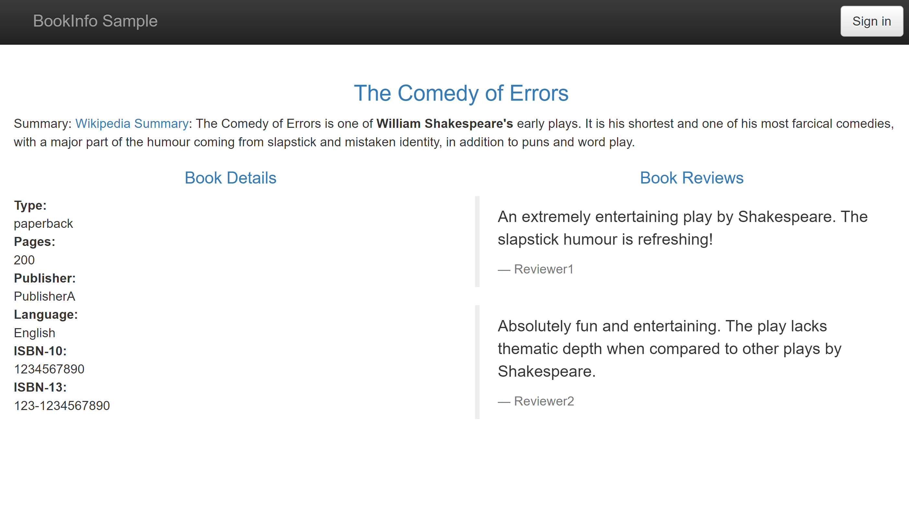
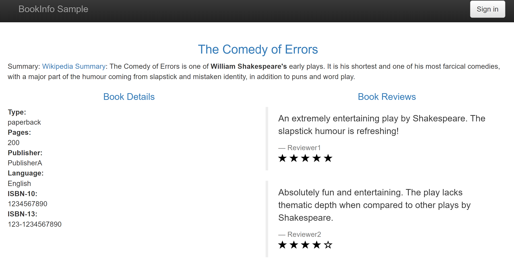
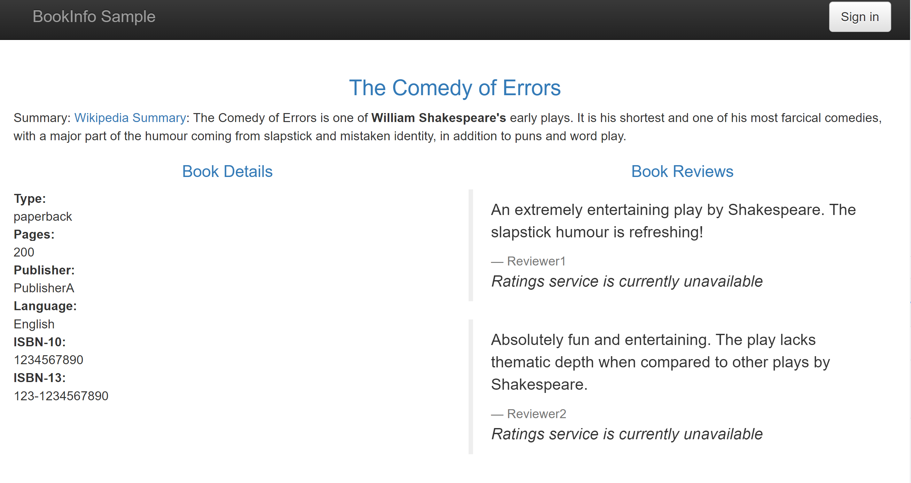

# BookInfo example with mTLS

This example is about the mTLS ability.

We set app's tls mode by add a label named 'polarismesh.cn/tls-mode'.

| App         | TLS MODE   |
| ----------- | ---------- |
| ProductPage | PERMISSIVE |
| Reviews V1  | PERMISSIVE |
| Reviews V2  | STRICT     |
| Reviews V3  | NONE       |
| Details     | STRICT     |
| Ratings     | STRICT     |

Because `Reviews V3`'s tls mode is NONE, and `Ratings` is STRICT,  `Reviews V3` will connect to `Ratings` failed.

| App         | Target     | Connectivity |
| ----------- | ---------- | ------------ |
| ProductPage | Reviews V1 | mTLS         |
| ProductPage | Reviews V2 | mTLS         |
| ProductPage | Reviews V3 | Raw          |
| Reviews V2  | Ratings    | mTLS         |
| Reviews V3  | Ratings    | Failed       |
| ProductPage | Details    | mTLS         |

Bookinfo's architecture:

You will see:

or 

or

You will not see the red stars rating.