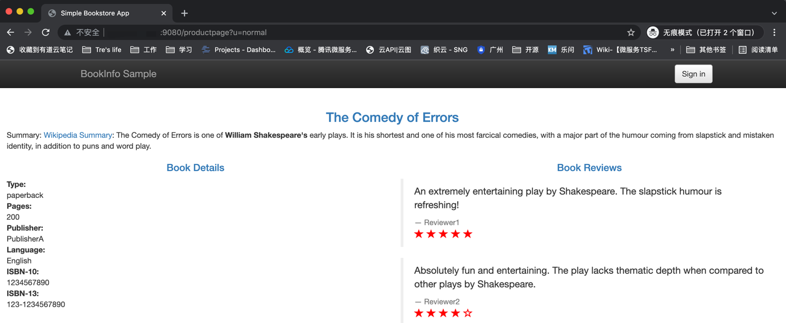

# bookinfo 应用

这个工程演示如何在北极星环境中部署 istio 的 bookinfo 应用。在这个示例中，北极星作为 bookinfo 应用的控制面板，提供服务治理能力。

## 开始之前

部署前，您需要保证：

1. Polaris Server 已经安装完成，参考[Polaris server 安装手册](https://github.com/polarismesh/website/blob/main/docs/zh/doc/%E5%BF%AB%E9%80%9F%E5%85%A5%E9%97%A8/%E5%AE%89%E8%A3%85%E6%9C%8D%E5%8A%A1%E7%AB%AF/%E5%AE%89%E8%A3%85%E9%9B%86%E7%BE%A4%E7%89%88.md)
2. Polaris Controller 已经安装完成，参考[Polaris 网格使用指南](https://github.com/polarismesh/website/blob/main/docs/zh/doc/%E5%BF%AB%E9%80%9F%E5%85%A5%E9%97%A8/%E4%BD%BF%E7%94%A8%E6%9C%8D%E5%8A%A1%E7%BD%91%E6%A0%BC/%E4%BD%BF%E7%94%A8K8s%E5%92%8C%E7%BD%91%E6%A0%BC.md)

## 部署 bookinfo 应用

1. 为 `default` 命名空间打上标签 `polaris-injection=enabled`:

```shell
kubectl label namespace default polaris-injection=enabled 
```

2. 使用 `kubectl` 部署应用

```shell
kubectl apply -f bookinfo.yaml
```

确认所有的 service 和 Pod 正常运行：

```shell
$ kubectl get service
NAME             TYPE           CLUSTER-IP       EXTERNAL-IP     PORT(S)          AGE
details          ClusterIP      172.16.255.56    <none>          9080/TCP         2d1h
productpage      LoadBalancer   172.16.252.10    x.x.x.x         9080:30145/TCP   2d1h
ratings          ClusterIP      172.16.255.108   <none>          9080/TCP         2d1h
reviews          ClusterIP      172.16.252.86    <none>          9080/TCP         2d1h
```

```shell
$ kubectl get pod
NAME                               READY   STATUS    RESTARTS   AGE
details-v1-66b6955995-xhsr5        3/3     Running   0          2d1h
productpage-v1-7955cdc67f-7nxq7    3/3     Running   0          2d1h
ratings-v1-fd78f799f-d7n9t         3/3     Running   0          2d1h
reviews-v1-5db66dc4c7-pdqfx        3/3     Running   0          2d1h
reviews-v2-64774794f5-4cf9d        3/3     Running   0          2d1h
reviews-v3-6bd488d789-7q77s        3/3     Running   0          2d1h
```
3. 从外部访问 bookinfo 服务

如果您在 tke 上部署了 bookinfo 应用，则直接可以用 productpage 暴露的公网 ip 访问。 如果不在 tke 部署，您也可以参考 [bookinfo官网](https://istio.io/latest/zh/docs/examples/bookinfo/) 的方法部署 ingress ，确保可以从外部访问 k8s 集群的 productpage 服务。


## 效果展示

如果上述操作正常，通过 productpage 暴露的公网服务可以看到如下的页面，则 bookinfo 正常运行。
